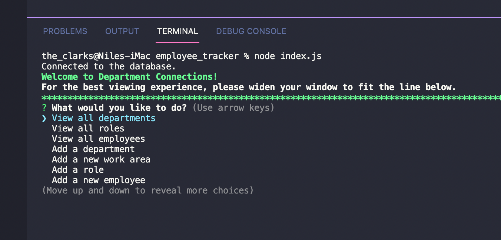
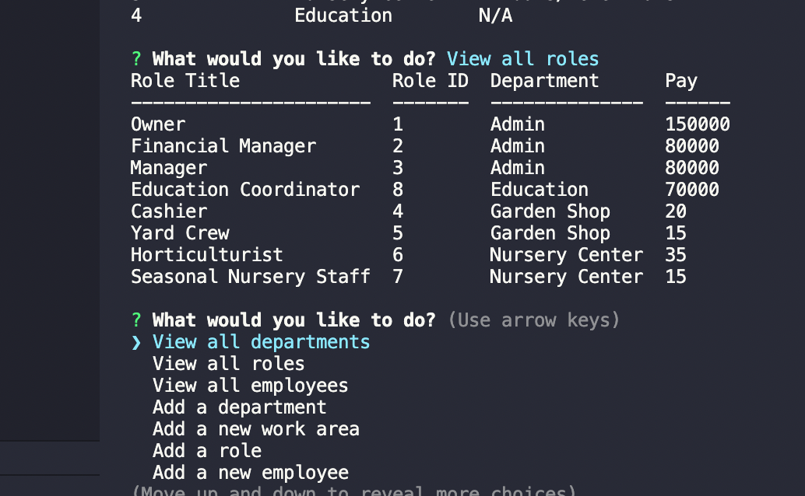

# Department Connections

This program is a Content Management System which is intended to basically manage the organizational structure and employee placement within an organization. While it does not provide the full functionality (you cannot terminate an employee, department, role, etc), it does allow for the viewing of the different structural pieces, of the employee body as a whole, and for editing.
    
This program’s ERD and seed file are loosely based off a plant nursery I used to work for, which is why it includes subdepartments as well as departments. One role belongs to one department, but may belong to many subdepartments. There is also a large employee group included in seeds to give you something to work with. Currently you NEED the prepopulated data in seeds in order to use this program, but of course if this program was going to be a commercial product, I would want to eliminate the prepopulated information and instead provide prompts for them to create the table data from scratch. This can be a project for future development.

This program is a bit of a monster. It is not written efficiently. In terms of future development, there is room for the greatest improvement in code formatting in the following areas: use of async/await for increased readability, use of constructors to ease the creation of the different db table rows, use of increased modularization to separate out db queries (which would also increase readability and ease of debugging, and make it easier to ensure that my lists of options in the inquirer prompts update dynamically as the db info changes). This is what I’d like to work on making a more knee-jerk part of my coding process in the future.

I learned a great deal about debugging and manipulating mySQL queries during this assignment. I can see my progression from the beginning of the project to the end and think when I review it later on to edit it, I will be able to improve it even further.

## Table of Contents
* [Installation](#installation)
* [Instructions for Use](#instructions-for-use)

* [License](#license)
    
## Installation
1. This program requires the following programs be installed:<ul><li>node.js</li><li>npm colors</li><li>npm console.table</li><li>npm dotenv</li><li>npm inquirer</li><li>npm mysql2</li></ul>

2. Before running this program, please have the following information on hand and / or loaded into your 'asset/images' folder:<ul>none</ul>

## Instructions for Use
<ol><li>Ensure that your computer has node.js installed, clone/fork repos to your local computer, open in code editor, in terminal opened at level of index.js install the npm packages, modify the .env file to hold your personal information.</li><li>Open up terminal at level of db, log into mysql, run schema.sql and seeds.sql.</li><li>Return to index.js terminal, initiate the program w/ ‘node index.js’ command.</li><li>You will be prompted to select a task you would like to complete. </li><li>Each task has its own set of instructions. Just following them along will lead you to complete the task, at the end of which you will be presented with a table showing you the results.</li><li>You may exit the program at any time from the main menu.</li></ol>

Here is a [video walkthrough](https://drive.google.com/file/d/1gmUmJAMcrN-CGIeM2IVM_R6FSCym0Foz/view?usp=sharing).

## License
The files in this repository are covered by the [MIT License](https://choosealicense.com/licenses/mit/).
